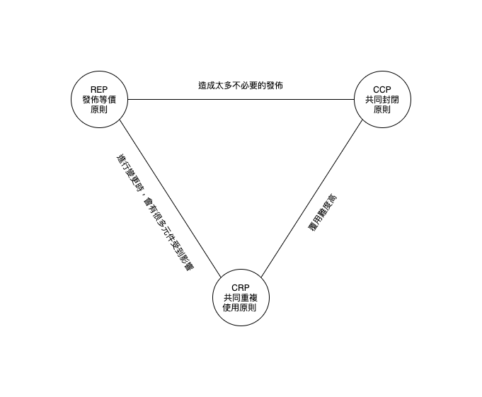

# Chapter 13 - 元件內聚性

本章會討論到關於元件內聚性的三個原則：

- 再使用性 - 發佈等價原則
  - The Reuse/Release Equivalence Principle
  - 簡稱 REP
- 共同封閉原則
  - The Common Closure Principle
  - 簡稱 CCP
- 共同重複使用原則
  - The Common Reuse Principle
  - 簡稱 CRP

## 再使用性 - 發佈等價原則 (REP)

    再使用性的細微度就是發佈的細微度

使軟體擁有再使用性，是物件導向模型的其中一個承諾

從軟體設計及架構的角度來看，這個原則意味著組成一個元件的類別及模組必須是一個擁有高內聚性的群組

## 共同封閉原則 (CCP)

    將那些會因相同理由、在相同時間發生變化的那些類別收集到相同的元件之中。
    將那些在不同時間、因著不同理由發生變化的類別分割到不同的元件之中。

大致上我們可以將共同封閉原則(CCP)想像成單一職責原則(SRP)加上開放封閉原則(OCP)的元件版本。

### 與單一職責原則(SRP)相似

如同單一職責原則(SRP)規定一個**類別**不可包含多個引起變化的原因一般
，共同封閉原則(CCP)規定了一個**元件**不該包含多個引起變化的原因。

如果一個方法會因不同的原因而改變，單一職責原則(SRP)告訴我們應該將這些方法劃分到不同的類別之中。
如果一個類別會因不同的原因而改變，共同封閉原則(CCP)告訴我們應該將這些類別劃分到不同的元件之中。

### 與開放封閉原則(OCP)相似

共同封閉原則(CCP)也和開放封閉原則(OCP)密切相關，共同封閉原則(CCP)中的「封閉」，與開放封閉原則(OCP)中的「封閉」具有相同意義。開放封閉原則OCP規定了類別的修改應當是封閉的，共同封閉原則(CCP)則透過`將那些會因相同理由、在相同時間發生變化的那些類別收集到相同的元件之中。`來試圖達成修改應當是封閉的概念(對元件來說的封閉)

共同封閉原則(CCP)鼓勵我們把可能基於相同原因而改變的類別聚集到同一個地方。如果兩個類別有著非常緊密的關係，通常他們總是會一起做出變化，所以他們應該屬於同一個元件。

## 共同重複使用原則 (CRP)

    不要強迫元件的使用者去依賴他們不需要的東西

共同重複使用原則(CRP)告訴我們，要把傾向於一起重用的類別及模組放入同一個元件之中。我們要確保放入元件中的類別是不可分割的－不可只依賴某些而不依賴其他類別。

假設有個元件A違反了原則，他使用了元件B的某個類別，則兩個元件則有著依賴關係，當我今天更改B的內容的時候A的行為就會存在風險，即便不用對A進行任何更改，也可能還是要對A進行重新編譯、驗證、部署的動作

### 與界面隔離原則(ISP)相似

共同重複使用原則(CRP)是界面隔離原則(ISP)的通用版

界面隔離原則(ISP)建議我們不要依賴包含我們未使用的方法的類別，共同重複使用原則(CRP)則建議我們不要依賴包含我們未使用的類別的元件。

## 三個原則之間的拉鋸

發佈等價原則(REP)與共同封閉原則(CCP)是包容性原則，他們會傾向於讓元件變得更大。
同重複使用原則(CRP)則是排除性原則，他使得元件變得小一些。

  
・張力圖

- 如果犧牲了發佈等價原則(REP)，則元件之間的複用難度會提升
- 如果犧牲了共同封閉原則(CCP)，會在進行變更時，會有很多元件受到影響
- 如果犧牲了共同重複使用原則(CRP)，則會造成太多不必要的發佈