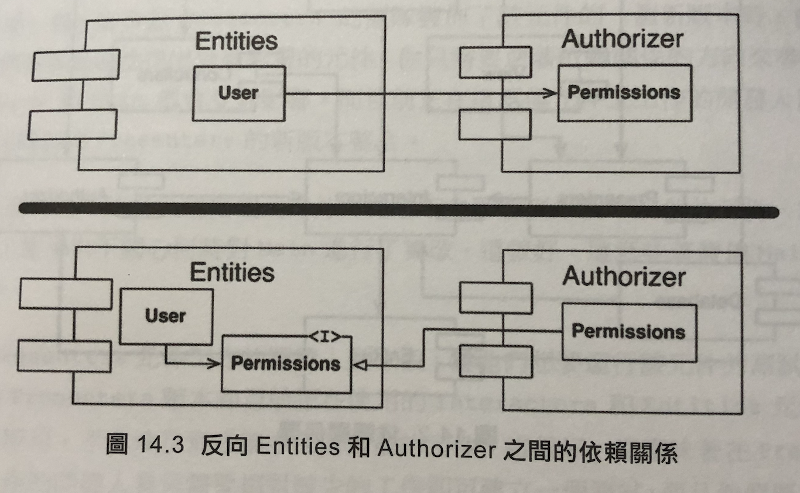
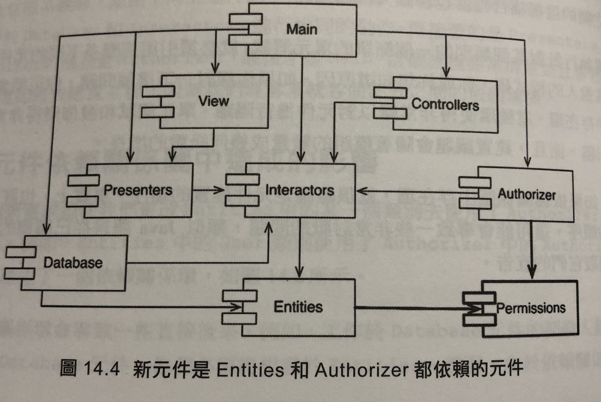

# Chapter 14 - 元件耦合性

本章會討論到關於元件耦合性的三個原則：

- 無環依賴原則
  - The Acyclic Dependencies Priciple
  - 簡稱 ADP
- 穩定依賴原則
  -  The Stable Dependencies Principle
  - 簡稱 SDP
- 穩定抽象原則
  - The Stable Abstractions Principle
  - 簡稱 SAP

## 無環依賴原則 (ADP)

    在元件的依賴關係圖中不允許出現環

如14-2圖中，`Database`的發佈必須相容於`Entities`，而遵循這個依賴關係，我們也必須讓`Authorizer`也相容，同時`Database`跟`Authorizer`都相容於`Interractors`，這使任何改動與發佈要付出很大的成本。這些元件之間的改動及行為必須要完全一致，事實上他們已經變成了同一個大元件。

### 解除依賴環

1. 使用依賴反轉原則(DIP)，新增介面至`Entities`中

2. 新建立一個`Entities`與`Authorizer`都依賴的元件(`Permission`)，不過此解決方案在存在改變的前提下，元件的結構是不穩定的。 
    
   不過此解決方案在存在改變的前提下，元件的結構是不穩定的。

## 穩定依賴原則 (SDP)

## 穩定抽象原則 (SAP)
